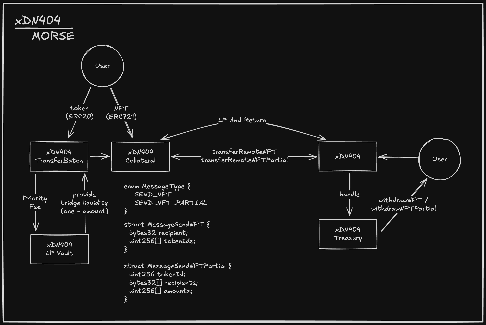

# xDN404 MORSE

> **⚠️ DEVELOPMENT STATUS**: This project is currently in development. xMorseTransferBatch contains AI-generated code and is not production-ready.

A cross-chain NFT transfer protocol that enables NFT transfers between Ethereum and Mitosis chains using the DN404 standard and Hyperlane messaging protocol.



## Overview

xDN404 MORSE connects Ethereum and Mitosis chains for NFT transfers using the DN404 standard. It includes a reroll mechanism for token ID mapping and supports both full NFT transfers and partial ownership transfers.

## Development Status

- ✅ **Core Architecture**: Base contracts and interfaces implemented
- ✅ **DN404 Integration**: Working with DN404 standard
- ✅ **Hyperlane Integration**: Cross-chain messaging setup
- ⚠️ **xMorseTransferBatch**: Contains AI-generated code, needs review
- 🔄 **Testing**: Basic tests implemented, comprehensive testing in progress
- 🔄 **Security Audit**: Not yet audited
- ❌ **Production Ready**: Not ready for mainnet deployment

## Architecture

### Cross-Chain Components

- **Ethereum Side**: `xDN404Collateral` contract manages underlying DN404 tokens
- **Mitosis Side**: `xDN404` contract handles cross-chain NFT operations
- **Treasury System**: `xDN404Treasury` manages cross-chain liquidity and operations

### Features

- **Bidirectional NFT Transfers**: Move NFTs between Ethereum and Mitosis
- **Partial Ownership**: Support for fractionalized NFT ownership across chains
- **Reroll Mechanism**: Token ID mapping system for cross-chain operations
- **Gas Optimization**: Cross-chain messaging with Hyperlane integration

## Installation

### Prerequisites

- [Foundry](https://getfoundry.sh/) (latest version)
- [Node.js](https://nodejs.org/) (v18+)
- [pnpm](https://pnpm.io/) (v10+)

### Setup

```bash
# Clone the repository
git clone <repository-url>
cd dn404x

# Install dependencies
pnpm install

# Install Solidity dependencies
forge soldeer install -d

# Build contracts
forge build

# Run tests
forge test
```

## Development

### Building and Testing

```bash
# Build contracts
forge build

# Run all tests
forge test

# Run tests with gas reports
forge test --gas-report

# Generate coverage report
pnpm coverage
```

### Code Quality

```bash
# Format code and check style
pnpm lint

# Check formatting without changes
pnpm lint:check
```

### Available Scripts

- `pnpm build` - Compile contracts
- `pnpm lint` - Format code and sort imports
- `pnpm lint:check` - Check code formatting
- `pnpm coverage` - Generate test coverage report

## Project Structure

```
dn404x/
├── src/
│   ├── xDN404Base.sol           # Base contract for cross-chain DN404 operations
│   ├── xDN404Treasury.sol       # Treasury contract for cross-chain liquidity
│   ├── xMorse.sol               # Main xMorse contract implementing DN404
│   ├── xMorseCollateral.sol     # Collateral contract for Ethereum side
│   ├── interfaces/               # Contract interfaces
│   └── libs/                     # Utility libraries
├── test/                         # Test files
├── dependencies/                  # Solidity dependencies
├── foundry.toml                  # Foundry configuration
└── package.json                  # Node.js dependencies
```

## Configuration

### Foundry Configuration

Key settings in `foundry.toml`:

- **Solidity Version**: 0.8.29
- **EVM Version**: Prague
- **Dependencies**: OpenZeppelin, DN404, Mitosis protocol, Hyperlane

### Dependencies & Remappings

| Dependency Name                       | Purpose / Description          | Remapping (foundry.toml) |
| ------------------------------------- | ------------------------------ | ------------------------ |
| `@openzeppelin/contracts`             | Security and utility contracts | `@oz/`                   |
| `@openzeppelin/contracts-upgradeable` | Upgradeable contract support   | `@ozu/`                  |
| `@hyperlane-xyz/core`                 | Cross-chain messaging          | `@hpl/`                  |
| `@mitosis-org/protocol`               | Mitosis vault interfaces       | `mitosis/`               |
| `@mitosis-org/stub`                   | Stub library for testing       | `@stub/`                 |
| `dn404`                               | DN404 token standard           | `@dn404/`                |
| `solady`                              | Gas-optimized utilities        | `@solady/`               |
| `forge-std`                           | Foundry standard library       | `@std/`                  |

## Core Contracts

### xDN404Base.sol

Base contract providing cross-chain DN404 functionality:

- `transferRemoteNFT()`: Transfer complete NFTs to remote chains
- `transferRemoteNFTPartial()`: Transfer partial NFT ownership
- `quoteTransferRemoteNFT()`: Get gas estimates for cross-chain transfers

### xMorse.sol

Main contract implementing the xDN404 standard:

- DN404 token implementation with cross-chain capabilities
- Upgradeable contract architecture
- Treasury integration for cross-chain operations

### xDN404Treasury.sol

Treasury contract managing cross-chain liquidity and operations:

- Handles incoming cross-chain messages
- Manages token reserves and distributions
- Supports partial ownership transfers

## Cross-Chain Operations

### Message Types

```solidity
enum MessageType {
    SEND_NFT,           // Full NFT transfer
    SEND_NFT_PARTIAL    // Partial ownership transfer
}
```

### Transfer Flow

1. **Ethereum → Mitosis**: User calls `transferRemoteNFT()` on `xDN404Collateral`
2. **Message Processing**: Hyperlane delivers message to Mitosis chain
3. **NFT Minting**: `xDN404` contract mints corresponding NFT on Mitosis
4. **Reroll Execution**: Token ID mapping is updated for cross-chain consistency

### Reroll Mechanism

The protocol implements a reroll system that maps token IDs between chains:

- **Ethereum IDs**: `[1 | 2 | 4 | 7 | 9]`
- **Mitosis IDs**: `[3 | 5 | 6 | 8]`
- **Dynamic Mapping**: Token IDs are reassigned during cross-chain transfers to maintain consistency

## Security Features

- **Ownable2Step**: Two-step ownership transfer
- **UUPS Upgradeable**: Upgradeable contract pattern with access control
- **Reentrancy Protection**: Protection against reentrancy attacks
- **Gas Limit Validation**: Gas estimation and validation for cross-chain operations

## Testing

```bash
# Run all tests
forge test

# Run specific test file
forge test --match-contract xMorse

# Run tests with verbose output
forge test -vvv

# Generate gas report
forge test --gas-report
```

## Gas Optimization

Gas optimization features:

- **Base Gas Limits**: 25,000 for ERC20 transfers, 50,000 for ERC721 transfers
- **Dynamic Gas Calculation**: Gas limits adjust based on operation complexity
- **Batch Operations**: Support for transferring multiple NFTs in single transaction

## Integration

### Hyperlane Integration

- Cross-chain messaging via Hyperlane protocol
- Gas router for cross-chain communication
- Hook system for custom message processing

### Mitosis Protocol

- Integration with Mitosis vault system
- Support for cross-chain liquidity operations
- Treasury management across chains

## License

This project is licensed under the Apache 2.0 License - see the [LICENSE](LICENSE) file for details.

## Contributing

1. Fork the repository
2. Create a feature branch
3. Make your changes
4. Add tests for new functionality
5. Ensure all tests pass
6. Submit a pull request

## Support

For questions and support:

- Open an issue on GitHub
- Join our community discussions
- Check the documentation for common questions

## Disclaimer

This software is provided "as is" without warranty. Use at your own risk. Cross-chain operations carry risks including message delivery failures, chain reorganizations, and smart contract vulnerabilities. This project is in development and not audited.
